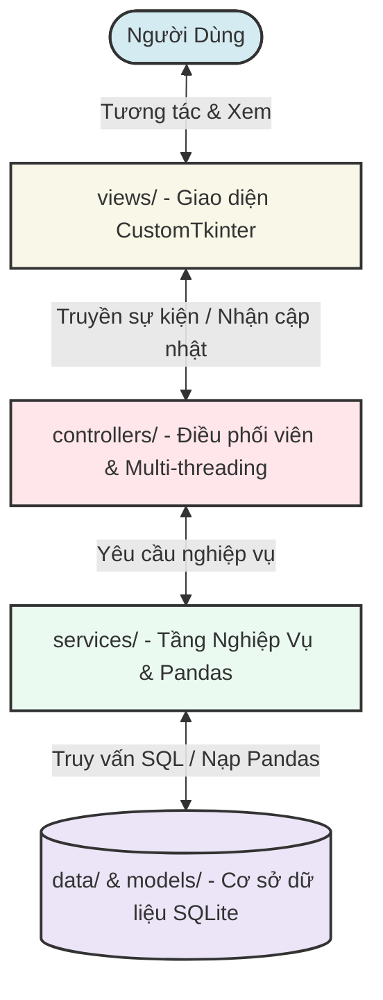

<h1 align="center">QUẢN LÝ CHI TIÊU CÁ NHÂN</h1>

<p align="center">
  
  
  
  
  
  
</p>

---

## 📖 MỤC LỤC

1. [Giới Thiệu Chung](#-giới-thiệu-chung)
2. [Tính Năng Nổi Bật](#-tính-năng-nổi-bật)
3. [Kiến Trúc Hệ Thống (MVC)](#-kiến-trúc-hệ-thống-mvc)
4. [Cấu Trúc Thư Mục Dự Án](#-cấu-trúc-thư-mục-dự-án)
5. [Hướng Dẫn Cài Đặt & Khởi Chạy](#-hướng-dẫn-cài-đặt--khởi-chạy)
6. [Mẹo & Phím Tắt Sử Dụng](#-mẹo--phím-tắt-sử-dụng)
7. [Tài Liệu Đi Kèm](#-tài-liệu-đi-kèm)
8. [Thông Tin Phát Triển](#-thông-tin-phát-triển)

---

## 🌟 GIỚI THIỆU CHUNG

**Quản Lý Chi Tiêu Cá Nhân** là ứng dụng desktop chuyên nghiệp hỗ trợ theo dõi tài chính cá nhân một cách trực quan, tối ưu và bảo mật. Dự án được phát triển bằng ngôn ngữ **Python**, kết hợp cùng thư viện giao diện hiện đại **CustomTkinter** mang lại trải nghiệm dark-mode sang trọng và thư viện **Matplotlib / Pandas** để xử lý, phân tích số liệu tài chính chuyên sâu.

Hệ thống được thiết kế theo tiêu chuẩn công nghiệp với kiến trúc **MVC (Model - View - Controller)** kết hợp **Service Layer**, giúp mã nguồn có độ độc lập cao, dễ dàng kiểm thử, bảo trì và mở rộng.

---

## ✨ TÍNH NĂNG NỔI BẬT

- 💸 Quản lý thu chi: Hỗ trợ thêm, chỉnh sửa, xóa và sao chép giao dịch nhanh chóng, giúp việc nhập liệu trở nên thuận tiện hơn.
- 📊 Thống kê và phân tích tài chính: Cung cấp các biểu đồ trực quan về tình hình thu chi, cơ cấu chi tiêu và xu hướng tài chính theo thời gian thông qua Matplotlib.
- 🎯 Quản lý ngân sách và mục tiêu tiết kiệm: Cho phép thiết lập hạn mức chi tiêu theo tháng, theo dõi tiến độ tiết kiệm và đưa ra cảnh báo khi chi tiêu vượt ngưỡng đã đặt.
- 📂 Nhập xuất dữ liệu CSV: Hỗ trợ import/export dữ liệu bằng Pandas, đồng thời tự động xử lý một số vấn đề thường gặp như ký tự BOM, dòng trống, khoảng trắng dư thừa, nhiều định dạng ngày tháng và dữ liệu số không hợp lệ.
- 🎨 Giao diện trực quan: Thiết kế hiện đại với bố cục rõ ràng, hỗ trợ hiệu ứng tương tác và hệ thống thông báo giúp người dùng dễ dàng theo dõi các thao tác trên ứng dụng.
- ⚡ Xử lý bất đồng bộ: Các tác vụ nặng như đọc tệp CSV lớn được thực hiện trên luồng nền nhằm đảm bảo giao diện luôn phản hồi ổn định trong quá trình sử dụng.
- 📝 Quản lý danh mục: Cho phép người dùng tự do tạo, chỉnh sửa, xóa và sắp xếp các danh mục thu chi theo nhu cầu cá nhân.

---

## 🏛️ KIẾN TRÚC HỆ THỐNG (MVC)

Ứng dụng tuân thủ nghiêm ngặt mô hình thiết kế **Model - View - Controller** mở rộng bằng cách tích hợp thêm **Service Layer** để xử lý logic nghiệp vụ và tương tác với lớp dữ liệu.



_Để tìm hiểu chi tiết hơn về luồng dữ liệu của hệ thống, vui lòng tham khảo tài liệu sơ đồ kiến trúc tại [SYS_MAP.md](SYS_MAP.md)._

---

## 📁 CẤU TRÚC THƯ MỤC DỰ ÁN

Mã nguồn được phân tách một cách khoa học thành các thư mục chuyên biệt:

```text
finance_manager/
├── main.py                      # File entry-point khởi chạy toàn bộ ứng dụng
├── requirements.txt             # Định nghĩa danh sách thư viện phụ thuộc
├── README.md                    # Tài liệu hướng dẫn sử dụng & cài đặt chính
├── UPDATE.md                    # Nhật ký cập nhật tính năng & sửa lỗi
├── SYS_MAP.md                   # Sơ đồ thiết kế và luồng MVC chi tiết
├── huong_dan_su_dung.pdf        # Tài liệu hướng dẫn người dùng cuối
│
├── data/
│   └── finance.db               # Cơ sở dữ liệu SQLite lưu trữ dữ liệu thực tế
│
├── models/
│   └── database.py              # Định nghĩa lược đồ (Schema) và khởi tạo bảng dữ liệu
│
├── services/
│   └── finance_service.py       # Tầng nghiệp vụ: Tương tác SQL, xử lý Pandas, tính toán biểu đồ
│
├── controllers/
│   └── main_controller.py      # Bộ điều phối sự kiện giữa View và Service, quản lý đa luồng (Multi-threading)
│
├── views/                       # Tầng giao diện người dùng
│   ├── core/                    # Cửa sổ chính (MainWindow), Header, Theme Styles
│   ├── dashboard/               # Tab hiển thị biểu đồ phân tích, Quản lý ngân sách & Tiết kiệm
│   ├── transactions/            # Bảng hiển thị giao dịch (Table), Dialog thêm/sửa, Bộ lọc thời gian
│   ├── categories/              # Quản lý danh mục thu/chi
│   └── common/                  # Thẻ thống kê (Cards), Loading spinner, Thông báo Toast
│
└── utils/
    └── logger.py                # Công cụ ghi logs hệ thống (System logs)
```

---

## 💻 HƯỚNG DẪN CÀI ĐẶT & KHỞI CHẠY

### 1. Yêu cầu hệ thống

- Yêu cầu máy tính cài đặt sẵn **Python 3.9** trở lên.

### 2. Cài đặt môi trường ảo và thư viện

Mở Terminal / Command Prompt tại thư mục dự án và thực hiện tuần tự các lệnh sau:

- **Tạo môi trường ảo (Virtual Environment):**
  ```bash
  python -m venv venv
  ```
- **Kích hoạt môi trường ảo:**
  - Trên Windows:
    ```powershell
    .\venv\Scripts\activate
    ```
  - Trên macOS/Linux:
    ```bash
    source venv/bin/activate
    ```
- **Cài đặt các thư viện phụ thuộc:**
  ```bash
  pip install -r requirements.txt
  ```

### 3. Dữ liệu thử nghiệm và Khởi chạy ứng dụng

- Dự án đã chuẩn bị sẵn hai bộ dữ liệu mẫu định dạng CSV để người dùng dễ dàng kiểm thử hiệu năng và bộ lọc:
  - `transactions_100.csv` (100 dòng dữ liệu mẫu)
  - `transactions_1000.csv` (1000 dòng dữ liệu mẫu)

  _(Bạn có thể sử dụng nút **"Nhập CSV"** ngay trên giao diện ứng dụng để nạp các file này)._

- **Lệnh khởi chạy ứng dụng:**
  ```bash
  python main.py
  ```

---

## 💡 MẸO & PHÍM TẮT SỬ DỤNG

- ⌨️ **Mở nhanh Form thêm giao dịch:** Sử dụng tổ hợp phím nóng `Ctrl + N`.
- 🔍 **Tìm kiếm nhanh:** Sử dụng tổ hợp phím nóng `Ctrl + F` để di chuyển con trỏ chuột tập trung vào thanh tìm kiếm.
- 🗑️ **Xóa nhanh giao dịch:** Bạn có thể quét chọn một hoặc nhiều dòng trên bảng dữ liệu (hoặc tích chọn checkbox trên tiêu đề đầu bảng) và nhấn phím `Delete` trên bàn phím.
- 🔄 **Đặt lại bộ lọc nhanh:** Nhấn nút **Đặt lại** để đưa tất cả các bộ lọc thời gian và tìm kiếm về trạng thái mặc định (Hiển thị tất cả dòng dữ liệu thay vì giới hạn theo ngày).

---

## 📚 TÀI LIỆU ĐI KÈM

Để nắm bắt trọn vẹn cách thức hoạt động và quá trình tối ưu ứng dụng, bạn nên đọc thêm:

1. **[SYS_MAP.md](SYS_MAP.md):** Giải thích chi tiết cấu trúc MVC, cách phân chia trách nhiệm giữa các Layer và sơ đồ luồng dữ liệu ví dụ.
2. **[UPDATE.md](UPDATE.md):** Xem nhật ký nâng cấp, giải pháp tối ưu hóa bộ lọc thời gian và kỹ thuật Pandas khử lỗi import file CSV.
3. **[huong_dan_su_dung.pdf](huong_dan_su_dung.pdf):** Tài liệu hướng dẫn sử dụng trực quan bằng tiếng Việt.

---

## 👥 THÔNG TIN PHÁT TRIỂN

- **Đề tài:** Ứng Dụng Quản Lý Chi Tiêu Cá Nhân Bằng Python & CustomTkinter
- **Tác giả:** Nguyễn Trung Hiếu
- **Nhóm thực hiện:** Nhóm 7 (Lớp LTPT_CNTTK2B)
