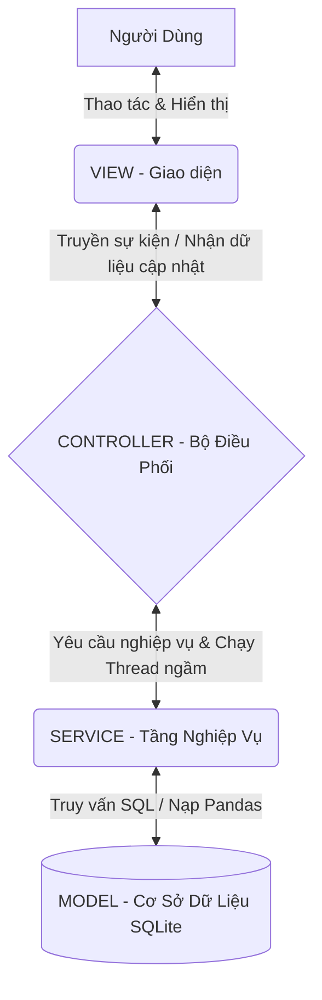

# 🗺️ SƠ ĐỒ HỆ THỐNG KIẾN TRÚC MVC (SYS_MAP.md)

Dự án **Quản Lý Chi Tiêu Cá Nhân (Final Version)** được xây dựng dựa trên mẫu thiết kế phần mềm **MVC (Model - View - Controller)** mở rộng, kết hợp cùng tầng **Service Layer** để xử lý nghiệp vụ độc lập. Sự phân tách mạnh mẽ này đảm bảo ứng dụng có thể mở rộng, bảo trì dễ dàng và luồng dữ liệu minh bạch.

---

## 🏛️ KIẾN TRÚC TỔNG QUAN

---

## 🧩 1. MODEL LAYER (`models/`)
**Nhiệm vụ:** Chịu trách nhiệm khởi tạo và cấu trúc hóa dữ liệu.
- `database.py`: 
  - Khởi tạo file vật lý SQLite `finance.db`.
  - Định nghĩa kiến trúc các bảng: `transactions` (Giao dịch), `categories` (Danh mục), `budgets` (Ngân sách), `savings_goals` (Mục tiêu tiết kiệm).
  - Tự động điền dữ liệu (Seed Data) mặc định vào bảng danh mục trong lần chạy đầu tiên.

## ⚙️ 2. SERVICE LAYER (`services/`)
**Nhiệm vụ:** Lớp nghiệp vụ chuyên sâu, gánh vác mọi trọng trách xử lý tính toán, I/O và SQL.
- `finance_service.py`:
  - **Tương tác SQL:** Tạo/Đọc/Sửa/Xóa (CRUD) các giao dịch, hạn mức.
  - **Cỗ máy tính toán Pandas:** Nơi sức mạnh của thư viện Pandas được phô diễn. Đảm nhiệm các việc nặng nề như đọc file CSV lớn, parse ngày tháng thông minh (`format='mixed'`), dọn dẹp data thừa, xuất file CSV.
  - **Data Analytics:** Nhóm dữ liệu theo hạng mục và chuỗi thời gian để cung cấp API dữ liệu biểu đồ cho View.

## 🎛️ 3. CONTROLLER LAYER (`controllers/`)
**Nhiệm vụ:** Người nhạc trưởng điều phối các luồng chạy giữa View và Service.
- `main_controller.py`:
  - Cung cấp các hàm Callback (như `add_transaction`, `import_csv`, v.v.) để View có thể gọi khi người dùng bấm nút.
  - **Kiểm soát Đa luồng (Threading):** Để giao diện không bị "treo" khi Service đang load file lớn, Controller đùn công việc đó vào một Background Thread và chỉ trả tín hiệu về Main Thread khi hoàn tất.

## 🖥️ 4. VIEW LAYER (`views/`)
**Nhiệm vụ:** Thể hiện đồ họa tĩnh/động (UI) bằng CustomTkinter và giao tiếp với con người.
- Được module hóa thành nhiều gói nhỏ:
  - `core/`: Giao diện gốc (Cửa sổ chính, Action Bar, Header).
  - `dashboard/`: Cửa sổ phân tích trực quan hóa (Matplotlib). Các file như `stats_tab.py`, `budget_tab.py` thuộc khối này.
  - `transactions/`: Lưới danh sách, Popup thêm sửa giao dịch, Dropdown chọn ngày.
  - `common/`: Các mảnh ghép UI dùng chung: Loading spinner, Toast Notification, Summary Cards.

## 🔁 LUỒNG HOẠT ĐỘNG THỰC TẾ (VÍ DỤ IMPORT CSV)
1. **[View]**: Người dùng bấm nút "Nhập CSV". View gọi tới hàm `self.controller.import_csv(filepath)`.
2. **[Controller]**: Tạo một Thread nền để xử lý. Gọi tới hàm `self.service.import_from_csv(filepath)`.
3. **[Service]**: Dùng thư viện Pandas tải file CSV, khử rác, chuẩn hóa định dạng, và Insert hàng loạt vào `finance.db`.
4. **[Model]**: DB ghi nhận dữ liệu lưu xuống ổ cứng.
5. **[Service]**: Trả về tín hiệu "Thành công" cho Controller.
6. **[Controller]**: Bắt tín hiệu, chuyển sang Main Thread bằng `.after()` và báo lệnh "Làm mới dữ liệu" cho View.
7. **[View]**: Đóng loading spinner, lấy danh sách giao dịch mới và hiện Toast Notification màu xanh lá!
